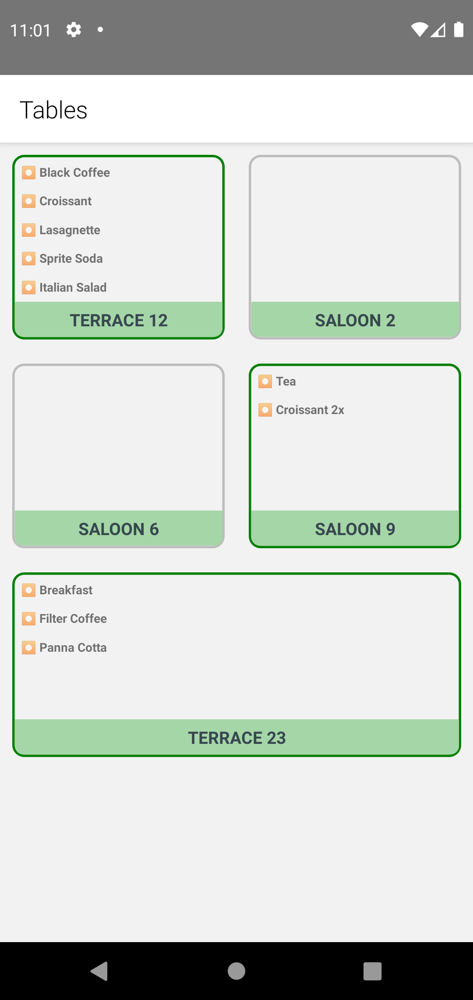

# week_3-OsmanAlperCAM
Inavitas&Basarsoft react-native bootcamp 3rd week homework organized by patika.dev

## Introduction
The purpose of this Assignment is to improve the codes of the application made.

## Screenshots

